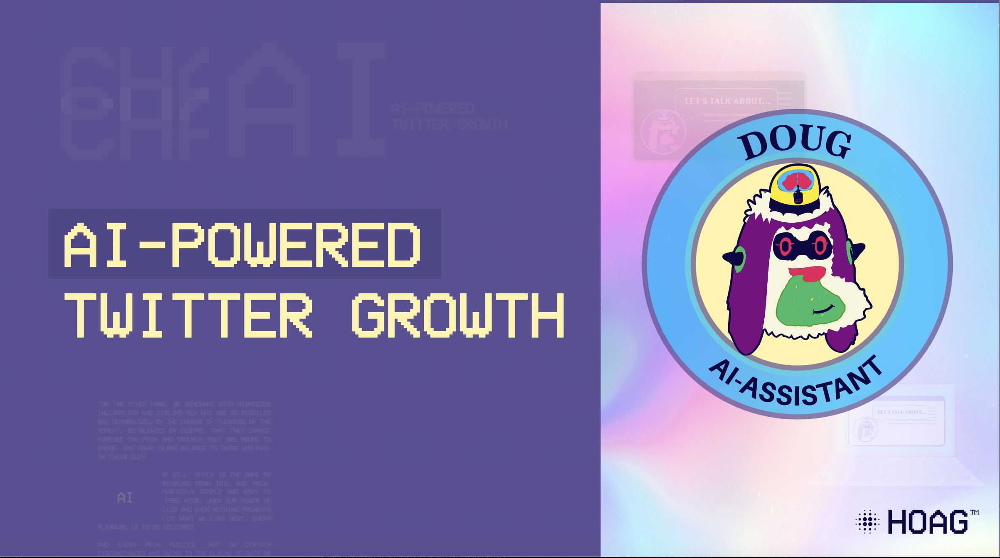

### Doug Works for Solana Grizzlython
Doug leverages web3 capabilities with a subscription-based model license in the form of a Solana Non-Fungible-Token (NFT). 

Our product utilizes the ChatGPT API and the Twitter API to simplify content creation, scheduling, and performance tracking on Twitter. 
ChatGPT API generates engaging content ideas quickly, while the Twitter API allows users to schedule tweets and track performance metrics

* [Website](https://doug.works)
* [https://twitter.com/dougworksai](https://twitter.com/dougworksai)

### One-Sheet

### Product

#### Coming Soon 

